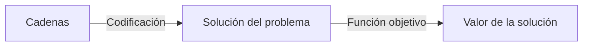

### Genetica de poblaciones

Es la rama de la genetica cuya problematica es describir la variacion y distribucion biologica con el objeto de dar explicacion a fenomenos evolutivos

**Fenomenos evolutivos:
- Mutacion
- Deriva genetica
- Migracion
### Conceptos biológicos

- **Cromosomas**: Cadenas de ADN, consiste de genes. cada gen codifica una proteina en particular (rasgos)
- **Alelos**: Posibles valores para un rasgo
- **Locus**: Posicion de un gen en el coromosoma
- **Genoma**: Conjunto completo de material genetico (todos los cromosomas)
- **Genotipo**: Conjunto particular de genes en un genoma
- **Fenotipo**: El genotipo es la base para el fenotipo del organismo
------------------------------------------------------------------------
## Algoritmos genéticos

> Son herramientas heurísticas para resolver problemas de optimización combinatoria

La forma en la que trabajan es generando una poblacion de posibles soluciones que se le aplican operadores para evolucionarlos a soluciones de mejor calidad

Fueron desatollados por **John Holland** a principios de los 1960 motivado por el aprendizaje de maquina

Son algoritmos de busqueda basados en los mecanismos de seleccion natural y los principios de la genetica

El ***cromosoma*** es una representación de una solución usualmente una cadena de bits binaria. A cada posición de la cadena se le denomina ***gen*** y al valor dentro de esa posición se le llama ***alelo***

Genotipo -> cadena de cromosoma
Fenotipo -> Solución de problema
Adaptabilidad -> Valor de la solución

![[Pasted image 20250223140311.png]]
#### Algoritmo basico
1. Generar una población inicial
2. Calcular fitness
3. Seleccionar
4. Aplicar operadores genéticos
5. Ciclar hasta que cierta condición se satisfaga
#### Características
- Son los mas utilizados
- Son robustos
- Utilizan dos espacios separados
	- De búsqueda - Solución codificada (Genotipo)
	- De solución - Soluciones reales (Fenotipo)
- Los genotipos deben ser convertidos en fenotipos antes de evaluar la adaptación de cada solución
### Tipos de selección
Se seleccionan de acuerdo a su fitness favoreciendo a los mas aptos. Buscando reproducir siempre a los mejores individuos de la poblacion agtual, siempre converge a una solucion local pero no necesariamente a una global

- **Torneo**
	- Competencia entre n individuos escogidos al azar, el que gana se queda y el que pierde se va a una pila, se repite hasta que ya no queden individuos en la poblacion
	- Al final se escoge al que se quede en el tope de la pila
- **Ruleta**
	- Los miembos mas altos tienen una probabilidad mas grande
	- Para escoger un cromosoma se gira la ruleta y se esocge el cromosoma del punto en donde se detenga
- **Elitista**
- **Estado Estable**
- **Escalafón**
### Recombinacion
Los cromosomas seleccionados se aparean aleatoriamente hasta compeletar una poblacion del mismo tamano que la inicial. El apareamiento se lleva a cabo mediante el cruce
#### Operadores de cruce
- Cruce de un solo punto
- Cruce de dos puntos
### Mutación
Se escoge un pequeño numero de cromosomas al azar. En cada de estos se escoge un gen al azar y sobre este se cambia aleatoria mente un bit

- De un punto
- De varios puntos
- Mutación global
### Fitness
A cada solución (Cromosoma) se le asigna un valor dependiente que tan bueno es el cromosoma solucionando un problema
### Para aplicar el algoritmo genético se requieren 5 componentes
- Una representación de soluciones potenciales
- Una forma de crear una población inicial de soluciones
- Una función de evaluación que juegue el papel de ambiente clasificando soluciones en termino de aptitud
- Operadores geneticos que alteren la composicion de los hijos
- Valores para los diferentes parametros que utiliza el algoritmo genetico
# EDAs (Estimation of Distribution Algorithms)

Los **EDAs** son algoritmos heurísticos de optimización que, al igual que los algoritmos genéticos (**AG**), basan su búsqueda en un proceso estocástico. Sin embargo, la diferencia clave es que en los **EDAs** la evolución no se realiza mediante operadores como **cruce** y **mutación**, sino a través de la estimación y muestreo de una **distribución de probabilidad**.

### **Diferencias entre EDAs y Algoritmos Genéticos**

- En los **AG**, la evolución ocurre mediante operadores genéticos que modifican la población de manera implícita.
- En los **EDAs**, la evolución se basa en construir explícitamente una **distribución de probabilidad** a partir de los individuos seleccionados de la generación anterior.
- La siguiente generación de soluciones se obtiene **muestreando** esta distribución estimada, sin necesidad de aplicar mutación o cruce.

### **Estimación de Distribución y su Desafío**

El desafío principal en los **EDAs** es la estimación de la **distribución de probabilidad conjunta** que modela la relación entre las variables en la población seleccionada. Mientras que los **AG** manejan estas relaciones de forma implícita mediante la evolución tradicional, los **EDAs** requieren un modelo probabilístico que capture dichas interdependencias de manera explícita.

### **Ejemplo: Problema OneMax**

Para ilustrar cómo funcionan los **EDAs**, consideremos el problema **OneMax**, donde el objetivo es maximizar la cantidad de **1s** en una cadena binaria.

1. Se genera una **población inicial aleatoria** de individuos (cadenas binarias).
2. Se seleccionan los mejores individuos de acuerdo con la función objetivo.
3. Se construye una **distribución de probabilidad** sobre cada **posición** (alelo) en la cadena, de modo que el porcentaje de **1s** en la nueva población **no sea menor** que en la población anterior.
4. Se genera una nueva población **muestreando** esta distribución.
5. Se repite el proceso hasta alcanzar una solución óptima.

### **Conclusión**

Los **EDAs** representan una alternativa a los algoritmos genéticos al enfocarse en modelar explícitamente la relación entre variables en lugar de depender de operadores evolutivos tradicionales. Son útiles en problemas donde es beneficioso capturar patrones en los individuos más prometedores para guiar la exploración del espacio de soluciones.