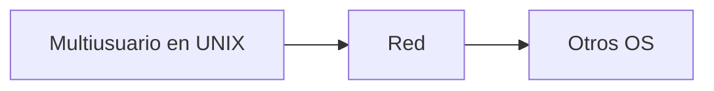
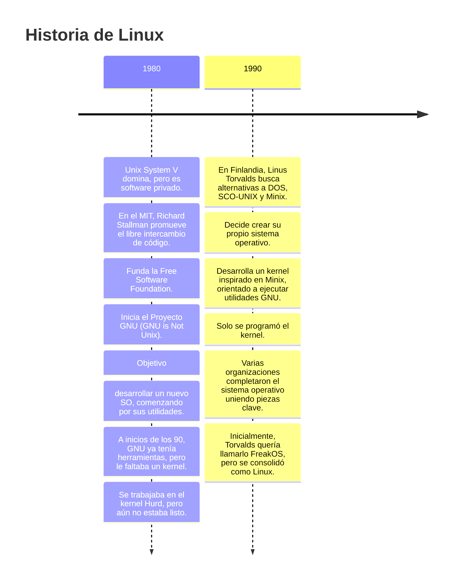

## S.O

### ¿Que hace?

- Administra recursos físicos (*hardware*) y los recursos lógicos (*Software*)
- Debe de trabajar reconociendo el hardware, que computadora y que tiene la computadora
- *Firmware:* Esta hecho solo para un dispositivo en especifico
- Mostrar una maquina extendida, Se ve inteligente y se usa a través de una interfaz hombre-maquina
### Funciones ABCD

- Administración de Aplicaciones -> Procesos
- Administración de Bases de información -> Datos
	- Memoria
	- Discos y Archivos
- Administración de Comunicaciones
	- Internas: Elementos físicos y lógicos
	- Externas: Dispositivos de red
- Administración de Displays -> interfaz hombre-maquina

Linux hace ABC, ya la D la hacen los WM , Windows ABCD
## Clasificación de Computadoras
### Grandes
- Super Computadoras
- Mainframes
### Medianas
- Midi
- Mini
- Workstation
- Servidores
### Pequeñas
- Micro Computadoras (PC)
- Computo móvil
	- Laptop, notebook, ultrabook
	- Netbook
- Tabletas
- Celulares y dispositivos digitales
- Computadoras embebidas SBS (Domotica y biotech)
- Wearables
## Software

Para que jale ocupo 3 cosas. El llamado triangulo de arquitectura
- Procesador [ISC]
- Maquina [Modelo]
- Sistema operativo

Las grandes y medianas computadoras son multiusuarios, las pequeñas son mono usuarios. No puedo agarrar la computadora de beto y trabajar los dos. En esas computadoras predomina UNIX.

En las PC predomina:
- Windows
- OSX
- Linux

En las Tabletas y celulares:
- IOS
- Android

# Unix y como se genero
## USA en los 60's

1. Movimientos de los Derechos civiles
2. Guerra Fria
3. Guerra de Vietnam
4. Carrera espacial
5. En la computación
	1. 3era Gen -> Buscaban multi-tasking ya que antes no se podia y el multi-user
	2. El software se tuvo que adaptar ya que teníamos el hardware y era muy caro cambiarlo
	3. Se creo el administrador de recursos time-sharing
## MULTICS
- AT&T -> Lab Bell
- Ken Tompson
- Demis Ritchie

## AT&T y el nacimiento de UNIX

AT&T manejaba tanto dinero en su época dorada que se dice que incluso financió el golpe de Estado en Chile en 1973. Pero más allá de la política, su impacto en la informática fue enorme.

En los laboratorios Bell de AT&T, un grupo de ingenieros trabajaba en un ambicioso proyecto llamado _Multics_ (Multiplexed Information and Computing Service), un sistema operativo de tiempo compartido. Sin embargo, debido a su excesiva complejidad y costos elevados, AT&T decidió abandonar el proyecto en 1969. Ken Thompson, Dennis Ritchie y otros investigadores del equipo no querían dejar atrás la idea de un sistema operativo eficiente y funcional, así que comenzaron a desarrollar su propia versión en una vieja computadora PDP-7.

Uno de los primeros programas que Thompson escribió en la PDP-7 fue _Space Travel_, un videojuego sobre exploración espacial. Sin embargo, la PDP-7 no era óptima para el trabajo y carecía de un buen sistema de archivos. Para solucionar esto, Thompson y Ritchie diseñaron un nuevo sistema de gestión de archivos y, con el tiempo, esto evolucionó en la creación de un sistema operativo. En broma, lo llamaron _UNICS_ (Uniplexed Information and Computing Service), una parodia de _Multics_, ya que era más simple y manejable. Posteriormente por problemas legales, el nombre se acortó a _UNIX_, sin ningún significado en particular, pero con un impacto que revolucionaría la informática.

#### El nacimiento del lenguaje C

El primer UNIX fue escrito en ensamblador para la PDP-7. Como reconocimiento a su trabajo, Thompson y Ritchie obtuvieron acceso a una PDP-11. Sin embargo, la PDP-11 usaba un ensamblador distinto, lo que hizo evidente la necesidad de un lenguaje más flexible y portable.

Dennis Ritchie comenzó diseñando el lenguaje _A_, el cual tenía características rudimentarias pero establecía las bases. Luego, junto con Thompson, desarrolló la versión mejorada llamada _B_, basada en BCPL (Basic Combined Programming Language). Finalmente, realizaron más modificaciones y mejoras, creando el lenguaje _C_.

El lenguaje C tenía dos características clave:

1. **Integración con ensamblador**, lo que permitía escribir código optimizado y eficiente.
2. **Portabilidad**, permitiendo que el código pudiera ejecutarse en distintas arquitecturas sin necesidad de reescribirlo desde cero.

Gracias a esto, UNIX fue reescrito en C, logrando que el 60% del código estuviera en este lenguaje y solo el 40% en ensamblador. Este hecho marcó un hito en la historia de la informática, ya que fue el primer sistema operativo portátil.

Después de eso intentan vender _UNIX_ pero le niegan el permiso

Aquí tienes tu texto con mejor estructura y claridad:

---

## **UNIX: De la Escuela a la Empresa**

### **El Código en la Escuela**

UNIX nace y se desarrolla en el ámbito académico, donde el código se modifica constantemente para mejorarlo, agregar nuevas funciones y características.

Los estudiantes que trabajan con UNIX eventualmente se gradúan y llevan sus conocimientos a las empresas, impulsando su adopción en el mundo laboral.

### **UNIX en las Empresas y el Conflicto Legal**

Aunque UNIX era ampliamente utilizado en universidades, su distribución en empresas no era del todo legal. AT&T, propietaria de UNIX, no podía vender software comercialmente debido a restricciones regulatorias. Para solucionar esto, AT&T creó **USL (Unix System Laboratories)**, una subsidiaria encargada de comercializar UNIX.

El producto de USL era **System V**, pero el problema era que muchas empresas ya usaban versiones gratuitas de UNIX.

### **La Batalla entre System V y BSD**

Uno de los UNIX más populares era el desarrollado en la Universidad de California: **BSD (Berkeley Software Distribution)**. Esto llevó a una demanda por parte de USL, alegando que BSD contenía código de UNIX propietario. Como resultado, BSD modificó su código y creó **BSD 3-Clause License (BSD Lite)**, eliminando cualquier rastro de código UNIX propietario.

Así, UNIX se dividió en dos grandes familias:

- **System V (USL)**
- **BSD**, que dio origen a varias distribuciones:
    - **NetBSD**
    - **FreeBSD** (Compatible con múltiples plataformas, "corre en todo como Doom")
    - **OpenBSD** (Enfocado en seguridad)

### **La Evolución en los Años 80**

Durante los años 80, UNIX y sus derivados comenzaron a impulsar el desarrollo de tecnologías para la construcción de redes de computadoras, sentando las bases de la interconectividad moderna.

El primero en desarrollar estas capacidades fue UNIX BSD, le siguió System V. Eso genero que el Internet se fortaleció con UNIX
### **Empresas y sus versiones de UNIX**

Durante la evolución de UNIX, varias compañías tomaron su base y desarrollaron sus propias versiones.

|**Compañía**|**Versión de UNIX**|
|---|---|
|**IBM**|AIX|
|**HP**|HP-UX|
|**DEC**|ULTRIX, OSF-1|
|**SGI**|IRIX|
|**Sun Microsystems**|SunOS, Solaris|
|**Apple**|A/UX|
|**Microsoft**|Xenix|
|**SCO**|Xenix (comprado a Microsoft)|

## Crisis y re estructuración de UNIX

1. **AT&T entra en crisis**
    - AT&T, la empresa creadora de UNIX, enfrenta problemas financieros y decide vender UNIX System Laboratories (USL), la división encargada de su desarrollo.

2. **Novell adquiere USL**
    - Novell, junto con su sistema **NetWare**, compra USL y lanza **UnixWare** como una nueva versión de UNIX.
    - Durante un tiempo, UnixWare se vuelve popular y genera buenos ingresos para Novell.

3. **Venta de UnixWare y System V**
    - Novell no logra competir contra Microsoft y decide vender UnixWare.
    - **The SCO Group (SCO)** adquiere **UnixWare, System V y NetWare**.

4. **El fin de NetWare**
    - Tras la adquisición, SCO decide **descontinuar NetWare** para centrarse en UnixWare y System V.
### Familia UNIX

La familia de sistemas operativos **UNIX** se divide en varias ramas:
- **System V**
- **BSD (Berkeley Software Distribution)**
- **Clones de UNIX:**
    - **Minix**
    - **QNX** (antes llamado Quick Unix)
    - **Linux**
### **El Conflicto de SCO con Linux**

SCO (Santa Cruz Operation) tuvo conflictos legales con la comunidad Linux:
1. **SCO y la Fusión Empresarial**
    - Para obtener financiamiento, SCO se fusiona con Conectiva (una empresa de Linux) y un bufete de demandas.
    - Así nace **SCO Group**, que empieza a reclamar derechos sobre Linux.
2. **Las Demandas**    
    - SCO Group amenaza con demandar a empresas que usaban Linux.
    - Entre sus objetivos estaban **IBM, HP y Red Hat**, quienes estaban generando ingresos con Linux.
    - SCO Group finalmente demanda a **IBM**.
3. **Resolución del Caso**
    - **IBM gana el juicio**: El veredicto favorece a IBM.
    - **SCO Group se declara en bancarrota**.
    - La empresa es comprada por **Xinu**, que luego es adquirida por **OpenText**.
### Distribuciones y Evolución de UNIX en Empresas

- **IBM** → Mantiene **AIX**.
- **HP** → Mantiene **HP-UX**.
- **Oracle** → Solaris cambia de rumbo:
    - Oracle lanza **OpenSolaris**.
    - La comunidad no quería que se llamara así, por lo que surgió **OpenIndiana**.
### Evolución de BSD

- **NetBSD**
- **FreeBSD** → Se derivan:
    - **DesktopBSD**
    - **DragonFly BSD**
- **OpenBSD**

### El Legado de Steve Jobs y NeXT

4. **Steve Wozniak crea NeXT**, una empresa que desarrolla **NeXTSTEP** en **C++**.
5. **Jobs introduce ideas innovadoras en NeXTSTEP**.
6. **Apple compra NeXT**, y Jobs regresa a Apple.
7. **Inician el proyecto Rhapsody**, basado en **OpenBSD**.
8. **Crean Darwin (basado en Mach y BSD), que da origen a macOS X**

### Clones
- Linux
- Minx

## *¿Qué es UNIX?

UNIX es un sistema operativo que puede trabajar en red y en la terminal. Es multiproceso, multitarea, multiusuario, portable y modular, siendo ampliamente utilizado en distintos tipos de computadoras.
### Filosofía de UNIX

- Todo en UNIX debe ser representado y administrado como archivo (Por eso es tan seguro por que protege los archivos)
- La belleza de la simplicidad _'Toda tarea debe tener una herramienta lo mas simple pero lo mas potente posible'_ también debe de interpretar
- La falta de noticias son buenas noticias
- Ademas es flexible y adaptable
### Características de UNIX

- **Multiusuario**: Permite que múltiples usuarios trabajen simultáneamente en el sistema.
- **Multiproceso**: Puede ejecutar varios procesos a la vez.
- **Portabilidad**: Se puede ejecutar en distintas arquitecturas de hardware.
### Hardware compatible con UNIX
#### Procesadores

- Motorola
- PowerPC
- UltraSPARC
- x86_64
- ARM
#### Arquitecturas

- **CISC** (Complex Instruction Set Computing)
- **RISC** (Reduced Instruction Set Computing)
#### Memoria

- ECC (Error-Correcting Code)
#### Almacenamiento

- SCSI
- RAID
- SAS
- Remote Distribution
### Terminal y Multiusuario

En UNIX, una **TTY** (teletype) es una terminal que consiste en un teclado y una conexión a un puerto serial. A través de esta, un usuario se conecta al sistema, permitiendo el acceso multiusuario.
### Workstations

Las workstations fueron diseñadas para ofrecer una mejor experiencia visual, incorporando tarjetas gráficas, bocinas, micrófonos y ratones. Sin embargo, su alto costo llevó a su declive. Para competir con las PC, se redujo su calidad para abaratar precios, lo que contribuyó aún más a su desaparición.

## Caracteristicas de UNIX

- Herramientas de software
- Portabilidad
- Potencia
- Flexibilidad
- Multitarea, Multiplataforma
- Elegancia
- Orientado a redes
- Integracion de nuevas o mejores tecnologías

### Mejoras

- Robustas
- Consistencia
- Agentes de usuario
- Nuevas capacidades
- Interoperabilidad
- Comparticion de recursos entre S.Os en el mismo equipo

### Estructura de un sistema Unix  

#### 1. Hardware  
   - Procesador, memoria, dispositivos de almacenamiento, periféricos.  

#### 2. Arranque del sistema  
   - **Bootloader**: carga el kernel en memoria. Ejemplos: **GRUB, LILO, systemd-boot**.  

#### 3. Kernel  
   - **Monolítico y modular**: administra los recursos del sistema.  
   - Manejo de procesos, memoria, archivos, dispositivos, redes.  
   - Controladores de hardware y módulos dinámicos.  

#### 4. Shells en Unix  
   - **Bourne Shell (`sh`)**  
   - **C Shell (`csh`)**  
   - **Korn Shell (`ksh`)**  
   - **Bourne Again Shell (`bash`)**  
   - **Z Shell (`zsh`)**  
   - **PowerShell (`pwsh`)** (en sistemas modernos como Linux con .NET)  

#### 5. Terminal y Consola  
   - **TTY (teletipo virtual)**: interfaz básica de texto.  
   - **Terminales gráficas**: XTerm, Konsole, GNOME Terminal, Alacritty.  

#### 6. Servidor gráfico  
   - **X11** (X.Org) o **Wayland** (moderno).  
   - Controladores de tarjeta gráfica (Mesa, NVIDIA, AMD).  

#### 7. Administrador de ventanas (WM)  
   - Controla la disposición y apariencia de las ventanas.  
   - Tipos:  
     - **Stacking (tradicional)**: Openbox, Fluxbox, XFWM.  
     - **Tiling (mosaico)**: i3, Sway, AwesomeWM.  

#### 8. Entorno de escritorio (DE)  
   - Proporciona una interfaz gráfica completa.  
   - Ejemplos: **GNOME (lo inició un mexicano 🇲🇽), KDE Plasma, XFCE, MATE, Cinnamon**.  

#### 9. Lenguajes de programación en Unix  
   - **C, C++** (para sistemas y bajo nivel).  
   - **Python, Perl, Bash** (scripting y automatización).  
   - **Go, Rust** (desarrollo moderno y seguro).  
   - **Java, JavaScript, PHP** (desarrollo web).  

#### 10. Aplicaciones del usuario  
   - **Editores de texto**: Vim, Emacs, Nano, Neovim.  
   - **Navegadores**: Firefox, Chromium, Lynx (modo texto).  
   - **Gestores de paquetes**: APT (Debian/Ubuntu), Pacman (Arch), DNF (Fedora).  
   - **Utilidades CLI**: `grep`, `awk`, `sed`, `htop`, `tmux`.
   

### Sesiones de trabajo en UNIX

#### Emuladores de terminal

- PuTTY
- Bitvise

#### Protocolos de conexión por Internet

- **Telnet** (inseguro)
- **SSH** (seguro)

### Funcionamiento de una sesión en terminal

La terminal trabaja con sesiones, y una sesión tiene tres momentos principales:

1. **Registro** (cuenta pública, contraseña, clave privada/secreta)
2. **Ejecución de órdenes**
3. **Cierre de sesión**

---

## El surgimiento de GNU/Linux

### Principales figuras

- **Richard Stallman** (Fundador de la Free Software Foundation y del Proyecto GNU)
- **Linus Torvalds** (Creador del kernel de Linux)

### ¿Qué hacen las distribuciones de Linux?

- Utilizan el **kernel** desarrollado por Linus Torvalds.
- Incorporan las **utilidades GNU**.
- Como resultado, nace **GNU/Linux**.

### Orientacion en las primeras distribuciones

Por el trabajo que hace una sola persona **SLACKWARE
- Trabajar de la forma mas cercana a un UNIX Tradicional
- Patrick Velkerdig
Cuando una comunidad realiza el trabajo **DEBIAN
- Presentar un sistema operativo 100% de codigo abierto y gratuito
- Debora
- Ian
- canonical se junta con windows para poder hacer la terminal de linux en windowsº
Tambien mint y uaabuntu
Mantenida por la comunidad pero financiada por RED HAT **FEDORA

Otra empresa llamada canonical queria usar codigo privado **UBUNTU

Cuando una empresa quiere ganar dinero **RED HAT

Una copia de red hat es CentOs pero RED HAT lo compra

otro clon es rocky os, eurolinux, red flag

## UNIX - GNU Linux - Archivos

#### Archivo

Flujo o secuencia identificada (_nombrada_) de bits (_bytes_). 
#### File systems

Estructura (logica) que da orden, organizacion y gestiona archivos

Almacenamiento secundario, debemos ver donde guardamos un bit donde guardamos un byte. Agarrar un almacenamiento secundario puro y aplicarle un concepto llamado formato (_formateo_) que es darle una estructura para poder meterle archivos

Cada sistema operativo define su propio formato. Cada uno maneja un concepto de archivo como quiere

| **S.O**        | FORMATO                                |
| :------------- | :------------------------------------- |
| **DOS**        | FAT                                    |
| **OS 2**       | HPFS                                   |
| **Windows NT** | NTFS, FAT 32                           |
| **Mac OSX**    | AFS,                                   |
| **UNIX**       | UFS                                    |
| **Linux**      | Ext(1,2,3,4), BTRF, XFS, RaisorFS, ZFS |
|                |                                        |
